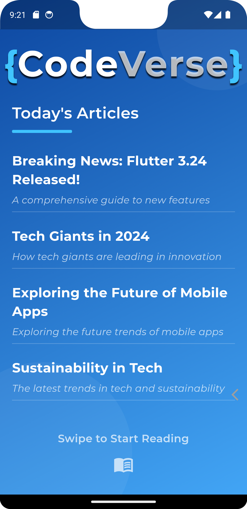
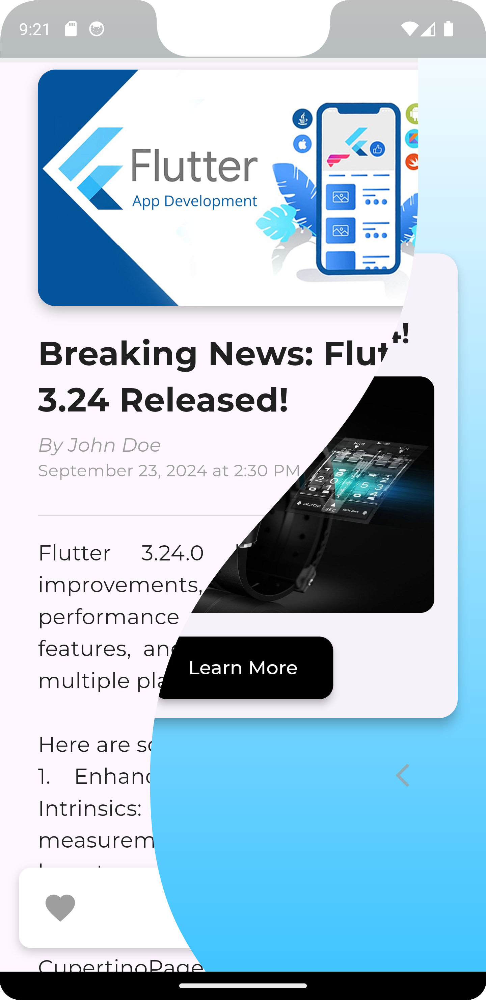
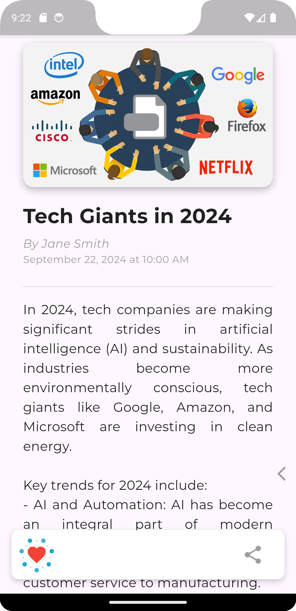
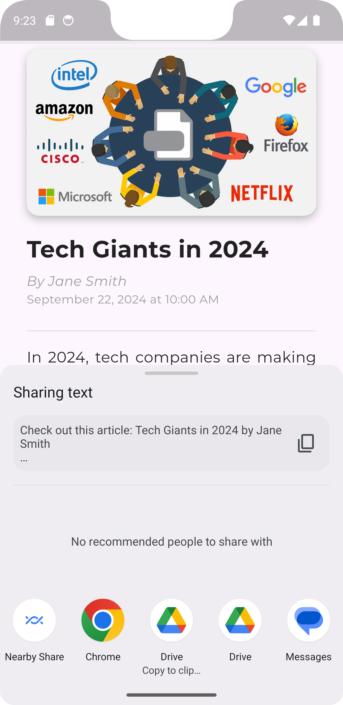

# CodeVerse Magazine App

A visually engaging and interactive digital magazine experience, featuring articles, advertisements, and a smooth Liquid Swipe interface.

Developed by **CodēCodes**  
Portfolio: [CodēCodes Portfolio](https://www.cod-e-codes.com/)  
GitHub: [CodēCodes GitHub](https://github.com/Cod-e-Codes)

## Features
- **Liquid Swipe Navigation**: Intuitive and interactive navigation between pages.
- **Rich Articles**: Includes author, publication date, content, and images.
- **Advertisements**: Polished ad pages for immersive integration.
- **Like and Share**: Enable users to like articles and share them on social platforms.
- **Reading Progress**: Display the current reading progress with a progress bar.

## Screenshots

Below are some screenshots showcasing the app's features:

  

  

  

  

  

## Installation
1. Clone this repository:
   ```bash
   git clone https://github.com/Cod-e-Codes/magazine-app.git
   ```
2. Navigate to the project directory:
   ```bash
   cd magazine-app
   ```
3. Install dependencies:
   ```bash
   flutter pub get
   ```
4. Run the app:
   ```bash
   flutter run
   ```

## How to Use
1. Swipe between pages to explore articles and advertisements.
2. Like and share articles using the action buttons.
3. Track reading progress using the progress bar at the top.

## Dependencies
- **Liquid Swipe**: For smooth page transitions.
- **Provider**: State management for scroll behavior.
- **Intl**: Formatting dates and times.
- **Like Button**: Interactive like button for articles.
- **Share Plus**: Easily share articles on various platforms.

## License
This project is licensed under the MIT License. See the LICENSE file for more details.

---

Developed with ❤️ by CodēCodes
